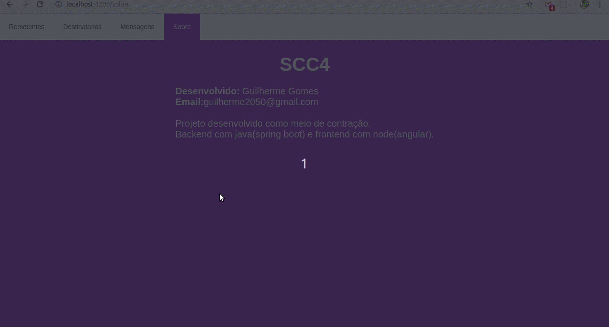

# scc4

### Projeto no intuito de contratação
 Mais detalhes no repositorio da [empresa](https://scc4.atlassian.net/wiki/spaces/RH/pages/9502764/Hands+on)
 
### Get-start
 - Instalar [node](https://nodejs.org/en/), [java](https://java.com/pt_BR/download/) e [maven](http://maven.apache.org/download.cgi)
 - Configurar o banco de dados no diretorio `scc4/src/main/resources/application.properties`
   - No desenvolvimento foi utilizado o banco [postgreSQL](https://www.postgresql.org/) junto com o [docker](https://www.docker.com/),
   mas como estamos usando ORM JPA fique a vontade para escolher seu banco de dados
#### BACKEND
 - Foi ultilizado [Spring Tools](https://spring.io/tools) para rodar o Spring Boot, 
 caso não deseje instalar favor seguir este [tutorial](https://spring.io/guides/gs/spring-boot/) 
 ou [este](http://www.appsdeveloperblog.com/run-spring-boot-app-from-a-command-line/).
 - Para instalar instalar as dependencias
#### FRONTEND
 - Para instalar as dependencias entrar na pastar `front` e rodar o seguinte comando `npm i`
 - Após isso rodar o seguinte comando `npm run start`.
 
#### ROTAS
  - Estará disponivél dois arquivos, um com as rotas da aplicação e 
  outro com um exemplo do arquivo que o BACKEND aceitar para subir destinatários.
  - Para geração do arquivo `routas.json` e desenvolvimento das routas foi utilizado[insomnia](https://insomnia.rest/download/) .
 
### Demonstração

